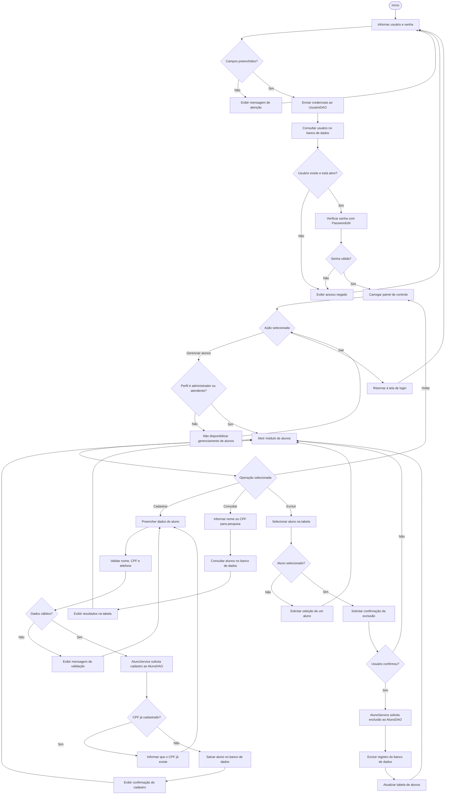

# Diagrama de Atividades — FitManager

Este diagrama representa o fluxo de autenticação e as principais operações disponíveis no módulo de gerenciamento de alunos.

```mermaid
flowchart TD
    A([Início]) --> B[Informar usuário e senha]
    B --> C{Campos preenchidos?}

    C -- Não --> D[Exibir mensagem de atenção]
    D --> B

    C -- Sim --> E[Enviar credenciais ao UsuarioDAO]
    E --> F[Consultar usuário no banco de dados]
    F --> G{Usuário existe e está ativo?}

    G -- Não --> H[Exibir acesso negado]
    H --> B

    G -- Sim --> I[Verificar senha com PasswordUtil]
    I --> J{Senha válida?}

    J -- Não --> H
    J -- Sim --> K[Carregar painel de controle]

    K --> L{Ação selecionada}

    L -- Gerenciar alunos --> M{Perfil é administrador ou atendente?}
    M -- Não --> N[Não disponibilizar gerenciamento de alunos]
    N --> L

    M -- Sim --> O[Abrir módulo de alunos]
    O --> P{Operação selecionada}

    P -- Cadastrar --> Q[Preencher dados do aluno]
    Q --> R[Validar nome, CPF e telefone]
    R --> S{Dados válidos?}

    S -- Não --> T[Exibir mensagem de validação]
    T --> Q

    S -- Sim --> U[AlunoService solicita cadastro ao AlunoDAO]
    U --> V{CPF já cadastrado?}

    V -- Sim --> W[Informar que o CPF já existe]
    W --> Q

    V -- Não --> X[Salvar aluno no banco de dados]
    X --> Y[Exibir confirmação do cadastro]
    Y --> O

    P -- Consultar --> Z[Informar nome ou CPF para pesquisa]
    Z --> AA[Consultar alunos no banco de dados]
    AA --> AB[Exibir resultados na tabela]
    AB --> O

    P -- Excluir --> AC[Selecionar aluno na tabela]
    AC --> AD{Aluno selecionado?}

    AD -- Não --> AE[Solicitar seleção de um aluno]
    AE --> O

    AD -- Sim --> AF[Solicitar confirmação da exclusão]
    AF --> AG{Usuário confirmou?}

    AG -- Não --> O
    AG -- Sim --> AH[AlunoService solicita exclusão ao AlunoDAO]
    AH --> AI[Excluir registro do banco de dados]
    AI --> AJ[Atualizar tabela de alunos]
    AJ --> O

    P -- Voltar --> K
    L -- Sair --> AK[Retornar à tela de login]
    AK --> B
```
