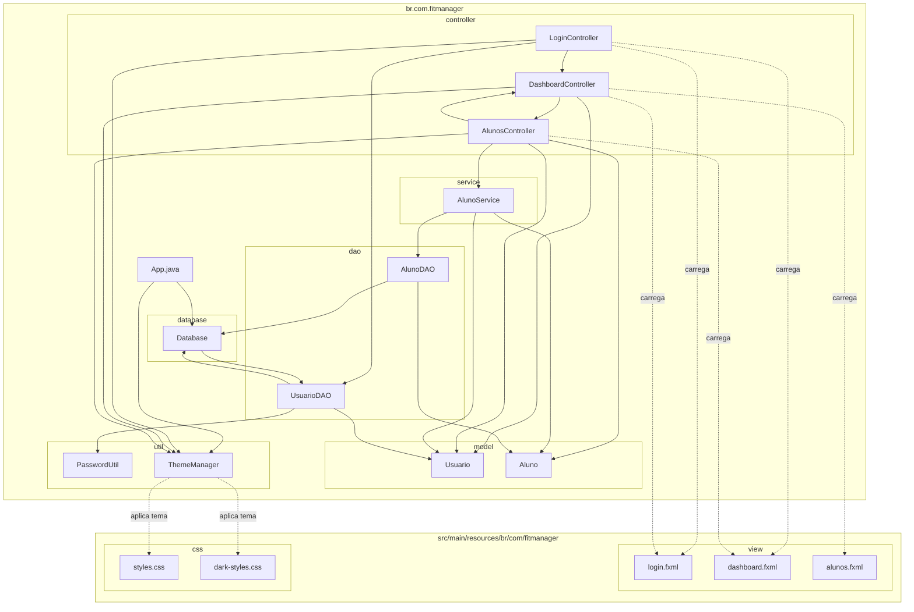

# Diagrama de Pacotes — FitManager

Este diagrama apresenta a organização dos pacotes e dos recursos do projeto, destacando as responsabilidades de cada camada e suas dependências.

```mermaid
flowchart TB

    subgraph A["br.com.fitmanager"]
        APP["App.java"]

        subgraph C["controller"]
            LC["LoginController"]
            DC["DashboardController"]
            AC["AlunosController"]
        end

        subgraph M["model"]
            U["Usuario"]
            AL["Aluno"]
        end

        subgraph S["service"]
            AS["AlunoService"]
        end

        subgraph D["dao"]
            UD["UsuarioDAO"]
            AD["AlunoDAO"]
        end

        subgraph DB["database"]
            DATABASE["Database"]
        end

        subgraph UTIL["util"]
            PU["PasswordUtil"]
            TM["ThemeManager"]
        end
    end

    subgraph R["src/main/resources/br/com/fitmanager"]
        subgraph V["view"]
            LOGIN["login.fxml"]
            DASH["dashboard.fxml"]
            ALUNOS["alunos.fxml"]
        end

        subgraph CSS["css"]
            LIGHT["styles.css"]
            DARK["dark-styles.css"]
        end
    end

    APP --> DATABASE
    APP --> TM

    LC --> UD
    LC --> DC
    LC --> TM

    DC --> AC
    DC --> U
    DC --> TM

    AC --> AS
    AC --> U
    AC --> AL
    AC --> DC
    AC --> TM

    AS --> AD
    AS --> AL
    AS --> U

    UD --> DATABASE
    UD --> U
    UD --> PU

    AD --> DATABASE
    AD --> AL

    DATABASE --> UD

    LC -. carrega .-> LOGIN
    LC -. carrega .-> DASH
    DC -. carrega .-> ALUNOS
    DC -. carrega .-> LOGIN
    AC -. carrega .-> DASH

    TM -. aplica tema .-> LIGHT
    TM -. aplica tema .-> DARK
```
